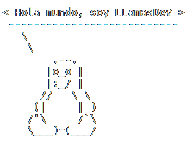

Apasionado del mundo de la programación y el mundo GNU/Linux.

## :office_worker: Trabajo
- Técnico administrador de sistemas Middleware

## :books: Estudios
- Desarrollo de aplicaciones multiplataforma (DAM)
- Administración de sistemas informáticos en red (ASIR)